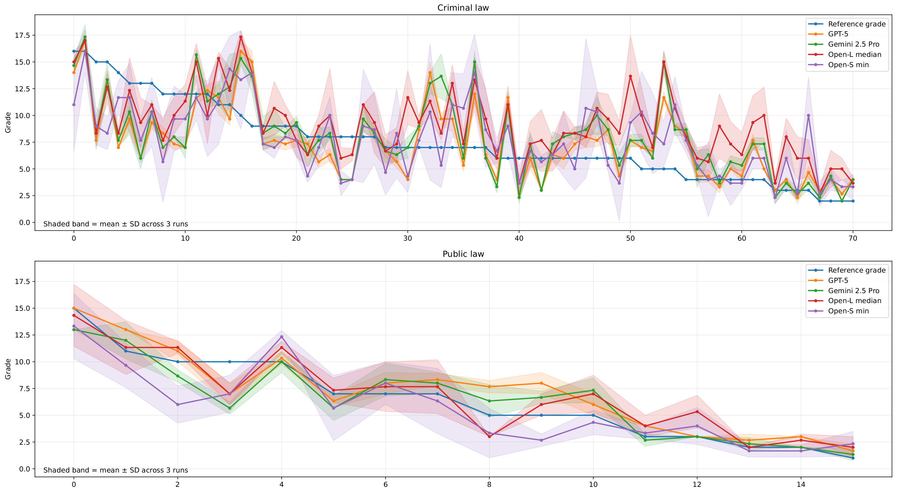
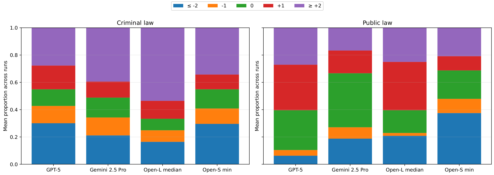

# GradeLegal: Automated Grading for German Legal Cases

This repository accompanies the ICAIL 2026 paper
**“GradeLegal: Automated Grading for German Legal Cases”**
 (now accepted as short paper!)

## Repository Structure
> [!NOTE]
> **Each subfolder contains its own README with additional details where relevant.**

- `code/`: Standalone Jupyter notebooks and code for analysis, ensembling, inference (reference), and figures.
- `data/`: released data artifacts (instructor materials and model's grades).
- `prompts/`: prompt skeletons used in the experiments (German originals + English translations for reference).

## Environments


This repository provides **two conda environments**:

- `environment_icail2026.yml`: use for **all analysis/code** (default).
- `environment_cuda_icail2026.yml`: use **only for vLLM-based inference** (CUDA/GPU required).


## Quickstart

Clone the repository and set up the environments:

```bash
git clone <REPO_URL>
cd <REPO_DIR>

# create the default (CPU) environment – use for analysis and most code
conda env create -f environment_icail2026.yml
conda activate environment_icail2026

# (optional) create the CUDA environment – use only for vLLM-based inference
conda deactivate
conda env create -f environment_cuda_icail2026.yml
conda activate environment_cuda_icail2026
```


---

> [!NOTE]
> ### Figures and Tables that did not make it to the five-page version of the paper due to space constrain.
---


**Figure 1.** Performance improvement (**Δ**) over the Task Agnostic baseline for each model, averaged across the criminal and public dataset, comparing **Instr. + Rubric**, **Instr. + Solution**, and **Instr. + Rubric + Sol.**

.png)

---

**Figure 2.** Grade trajectories under **Instr.+Rubric+Solution** for criminal law and public law. Cases are sorted by reference grade in descending order along the x-axis. Lines show mean predicted grades across runs, with shaded bands indicating ±1 SD, relative to the reference grade.


---

**Figure 3.** Error-bucket distribution under **Instr.+Rubric+Solution** for criminal law and public law. Stacked bars show the mean proportion across runs for each grading-error category and model.




---


---


**Table 1:** Summarized case facts and student tasks for criminal and public law; translated to English from German.

| Case fact | Student task |
|---|---|
| **Criminal Law:** A altered an inspection sticker, obstructed an overtaking driver who crashed while avoiding collision, and left; she also induced her sister to falsely accept responsibility for a speeding offense, and arranged an inaccurate alibi at trial, leading to A's conviction. The police later searched the sister's empty apartment based on a prosecutor's (not a judge's) order after detecting marijuana odor, found narcotics; the admissibility of that evidence is disputed. | Part I: Determine the criminal liability of A, her sister, and her friend. Part II: Analyze the admissibility of the narcotics evidence and whether an objection is required for any exclusion. |
| **Public Law:** A city enacted and published a pigeon-feeding ban that was adopted by the council despite not being on the council's meeting agenda. After a resident kept feeding pigeons, the city issued an individual enforcement order; he timely sued to annul it, alleging defects in the ordinance's adoption and legal basis. | Assess the likelihood of success of the annulment action against the individual order, including incidental review of the underlying ordinance's validity. |

---

**Table 2:** Summary statistics for criminal and public law. Grades use 0–18 scale. QWK (public law) between the instructor's grade and the rubric-equipped assistants.
| Dataset | **Criminal Law** | **Public Law** |
|---|---:|---:|
| Setting | Take-home | Exam cond. |
| Grade (μ ± σ; min–max) | 7.437 ± 3.569; 2–16 | 6.438 ± 3.932; 1–15 |
| QWK (μ ± σ) | N/A | 0.911 ± 0.066 |
| Tokens/words (μ ± σ) | 11796 ± 1639 / 6573 ± 878 | 2708 ± 781 / 1481 ± 447 |
| Rubric/Soln. | Yes/Yes | Yes/Yes |
| N | 71 | 16 |


---

**Table 3:** Agreement across prompt variants for criminal law. **Bold** / <ins>underline</ins> = best / runner-up per column. Values are **Pearson Corr.** ± **SD** over three runs. Top-3 reasoning and non-reasoning models from Table 1 . Baseline: Corr. ≈ 0.058 [from https://arxiv.org/abs/2412.15902].

| Group | **LLMs** | **Task Agnostic** | **Instr. + Rubric** | **Instr. + Solution** | **Instr.+Rubric + Solution** |
|---|---|---:|---:|---:|---:|
| Reasoning | GPT-5.1 | **0.497** ± 0.045 | 0.446 ± 0.054 | 0.454 ± 0.040 | 0.305 ± 0.026 |
| Reasoning | GPT-5 | <ins>0.454</ins> ± 0.031 | **0.598** ± 0.048 | 0.559 ± 0.023 | **0.599** ± 0.005 |
| Reasoning | GPT-5.2 | 0.453 ± 0.069 | 0.481 ± 0.033 | **0.587** ± 0.042 | <ins>0.589</ins> ± 0.023 |
| Non-Reasoning | Mistral-Large-3-675B | 0.429 ± 0.019 | 0.376 ± 0.044 | <ins>0.552</ins> ± 0.011 | 0.471 ± 0.049 |
| Non-Reasoning | GPT-4o | 0.228 ± 0.014 | 0.269 ± 0.044 | 0.400 ± 0.031 | 0.325 ± 0.051 |
| Non-Reasoning | GPT-4.1 | 0.369 ± 0.050 | <ins>0.581</ins> ± 0.030 | 0.492 ± 0.008 | 0.541 ± 0.016 |


